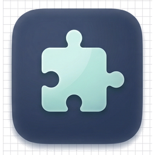
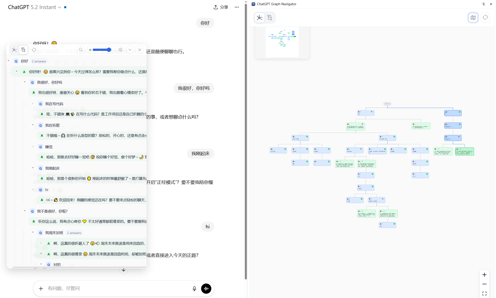
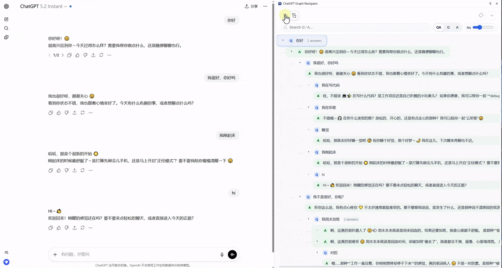
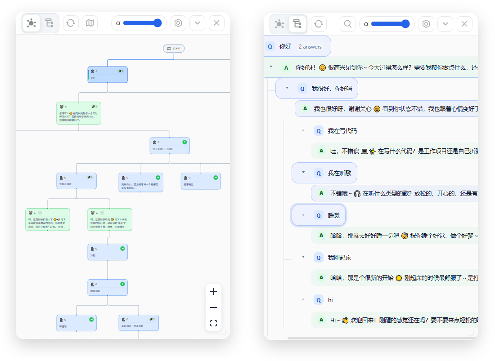

<div align="center">

<br>

  <h1>ContextFlow</h1>
  <h3>Chrome extension: map your ChatGPT threads, navigate context like a graph.</h3>

<p>
  
  
  
  
</p>

<table>
  <tr>
    <td align="center" width="200">
      
    </td>
    <td align="center" width="200">
      
    </td>
    <td align="center" width="200">
      
    </td>
  </tr>

  <tr>
    <td align="center">
      <strong>Graph View</strong>
    </td>
    <td align="center">
      <strong>Timeline Tree</strong>
    </td>
    <td align="center">
      <strong>Workflow Utils</strong>
    </td>
  </tr>

  <tr>
    <td align="center">
      <sub>Spatial visualization <br> for logical overview</sub>
    </td>
    <td align="center">
      <sub>Git-style history with<br>branch navigation</sub>
    </td>
    <td align="center">
      <sub>Message folding<br>& more to come</sub>
    </td>
  </tr>
</table>

  <h4>
    ✨ Visualize chat history as an interactive Q&A graph.<br>
    Built for long, branching ChatGPT sessions—see structure, jump to any turn, keep your reasoning tree clear.
  </h4>


<p align="center">
  <a href="#features">Features</a>
  &nbsp;·&nbsp;
  <a href="#installation">Installation</a>
  &nbsp;·&nbsp;
  <a href="#local-development">Local Development</a>
  &nbsp;·&nbsp;
  <a href="#documentation">Documentation</a>
  &nbsp;·&nbsp;
  <a href="#roadmap">Roadmap</a>
</p>

</div>

## Why linear chat is not enough

Complex work is rarely a straight line. You iterate, fork prompts, and compare answers. A single scrolling thread mixes all of that into one noisy timeline.

* **Context pollution:** Failed attempts and old tangents stay in view, diluting what the model should focus on and burning tokens.
* **Parallel exploration:** Regenerations and edits create branches that are hard to compare when everything looks like one flat history.
* **Cognitive load:** Reconstructing *which prompt led to which answer* after dozens of messages is exhausting.

**ContextFlow** turns that thread into a **navigable graph**: branches stay visible, jumps are one click, and optional enrichment (categories, summaries, merge-up) nudges the product toward a structured “context hierarchy” over time.

<br>

<h2 id="features">✨ Features</h2>

<div align="center">
  
</div>

### At a glance

* **Flexible UI:** **Sidebar** for a steady workflow, or a **floating window** for quick overlays.
* **Two views:**
    * **Graph:** A **Q&A tree** on React Flow—**Q** (user) and **A** (assistant) nodes with automatic layout.
    * **Timeline:** A Git-style vertical tree for fine-grained history and edits.
* **Jump to any node:** Open the exact message in the branch you picked.
* **Search:** Find prompts or answers across the whole tree.
* **Utilities:** Message auto-folding; more export and workflow tools planned.

### Sidebar: conversation command center

*Stay in the chat while you steer the structure.*

<div align="center">
  
</div>

<br>

#### 1. Graph mode

* **Q&A topology:** Each turn is a user **Q** and assistant **A**; questions can show **intent category** when enrichment runs.
* **Spatial control:** Zoom and pan to see the full branch structure.
* **One-click jump:** Select a node to scroll the ChatGPT UI to that message.

#### 2. Timeline mode

* **Filters:** **Q&A**, **questions only**, or **answers only**.
* **Search:** Jump straight to matches.

###  Floating window

* **Draggable / resizable** graph and timeline anywhere on screen.
* **Click-through** when you need to reach the page underneath.
* **Always on top** and **opacity** for a light overlay.

<div align="center">
  
</div>

### 🛠️ Workflow utilities

* **📂 Auto-folding** for long replies and code blocks.
* **🚀 Planned:** richer export (Markdown, images, PDF).
* **💡 Requests:** [Open an issue](https://github.com/Cynthia387/ContextFlow/issues) if you want a capability prioritized.

<br>
<br>

<h2 id="installation">📥 Installation</h2>

ContextFlow is **not** on the Chrome Web Store yet. Install by loading an unpacked extension from a **[GitHub Release](https://github.com/Cynthia387/ContextFlow/releases)** or from a **local build** (see [Local development](#local-development)).

### From GitHub Release (easiest)

1. Open **[Releases](https://github.com/Cynthia387/ContextFlow/releases)** and download the latest **`contextflow-v*.zip`** (for example `contextflow-v0.6.0.zip`).
2. **Unzip** it to a folder you will keep. Chrome reads files from disk, so do not delete or move that folder after installing.
3. Open **`chrome://extensions/`** in Chrome (or **`edge://extensions/`** in Edge, etc.).
4. Enable **Developer mode** (toggle in the top-right on Chrome).
5. Click **Load unpacked** and select the **unzipped folder**—the directory that contains **`manifest.json`** at the top level. Do not select the `.zip` file itself.

To update later: download the newer zip, unzip (you can replace the old folder), then on `chrome://extensions/` click **Reload** on the ContextFlow card.

### From source

1. Clone the repo, run **`npm install`**, then **`npm run build`**.
2. **Load unpacked** and choose the **repository root** (where `manifest.json` and the `dist/` folder live).

Alternatively, run **`npm run release`**: then **Load unpacked** and choose the **`release/`** folder, or unzip the generated **`contextflow-v*.zip`** in the project root and load that unpacked folder—the layout matches the Release download.

<br>
<br>

<h2 id="local-development">💻 Local development</h2>

Contributions are welcome. Typical setup:

### Prerequisites

* **[Node.js](https://nodejs.org/)** 18+
* **Package manager:** npm, [pnpm](https://pnpm.io/), or yarn
* **Browser:** Chrome or another Chromium browser

### Setup

1. **Clone**
    ```bash
    git clone https://github.com/Cynthia387/ContextFlow.git
    cd ContextFlow
    ```

2. **Install dependencies**
    ```bash
    npm install
    # or
    pnpm install
    ```
    On first build, `build.cjs` runs `npm install` if `esbuild` is missing (network required). Installing yourself first is still recommended.

3. **Watch mode**
    ```bash
    npm run dev
    ```
    Keep the process running while you edit sources.

4. **Production build**
    ```bash
    npm run build
    ```

**Other scripts:** `npm run build:release`, `npm run release` (see `scripts/release.js`), `npm run lint`, `npm run format`.

### Build pipeline

* **`build.cjs`** — CJS entry; ensures dependencies, then spawns the ESM build.
* **`build.impl.mjs`** — esbuild (`--watch`, `--release`, etc.).

### Project layout

```text
├── src/
│   ├── background/         # Service worker (IndexedDB, messaging)
│   ├── content/            # Injected into ChatGPT
│   │   ├── ui/             # Floating panel & sidebar React UI
│   │   ├── observers/      # DOM observers
│   │   └── parser/         # Mapping / API → graph model
│   ├── logic/              # Classifier, summarizer, manager, enrichment
│   └── sidepanel/          # Side panel app
│       ├── components/     # e.g. Q&A graph nodes
│       ├── hooks/
│       └── styles/
├── dist/                   # Build output
├── assets/
├── _locales/
├── manifest.json
├── build.cjs
└── build.impl.mjs
```

### Persisted node fields (contributors)

Nodes may include **`category`** (user intent), **`summary`** (bullets; grows with merge-up), and **`status`** (`active` | `archived`). IndexedDB is **v5** with indexes on `category` and `status`. See `src/shared/types.js` and `src/background/database/schema.js`.

<br>
<br>

<h2 id="documentation">📚 Documentation</h2>

* **[docs/architecture.md](docs/architecture.md)** — layers and data flow.
* **[docs/development.md](docs/development.md)** — debugging and conventions.
* **[CONTEXTFLOW_ARCH_GUIDE.md](CONTEXTFLOW_ARCH_GUIDE.md)** — MVP vision (classifier, summarizer, merge-up) and file map.

<br>
<br>

<h2 id="roadmap">🗺️ Roadmap</h2>

Goal: evolve ContextFlow into a stronger **knowledge and context system** for AI chats.

#### Done

* [x] **Core:** Q&A graph (React Flow) and Git-style timeline.
* [x] **UI:** Sidebar and floating window.
* [x] **Utils:** Message folding.
* [x] **Data:** IndexedDB v5 and optional enrichment fields.

#### Planned

**1. Annotation**

* [ ] Node highlights (e.g. important / todo / wrong).
* [ ] Branch bookmarks or pins.

**2. Graph editing**

* [ ] Prune nodes or whole branches.
* [ ] Custom edges across branches.

**3. Broader graph**

* [ ] Multiple conversations in one workspace.
* [ ] Projects grouping related threads.

**4. More utilities**

* [ ] Export (Markdown, JSON, images).
* [ ] Stronger global search.
* [ ] LaTeX copy helpers.

**5. Bugs**

* [ ] Some special nodes (e.g. certain image generations) still resist “jump to message”.

<h2 id="contributing">🤝 Contributing</h2>

Please **[open an issue](https://github.com/Cynthia387/ContextFlow/issues)** or send a pull request.

## 📄 License


**MIT** — see `package.json`.
